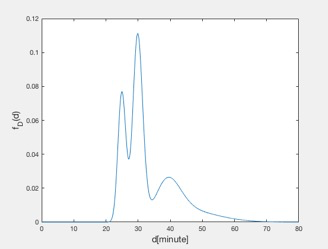
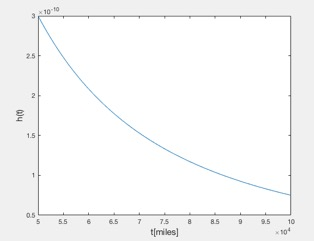
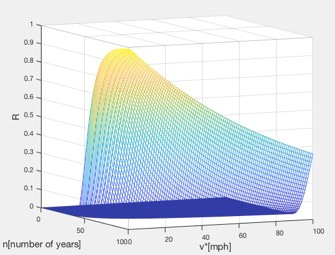
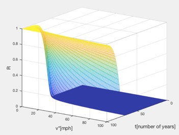
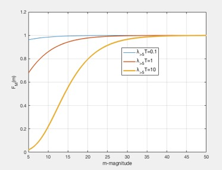
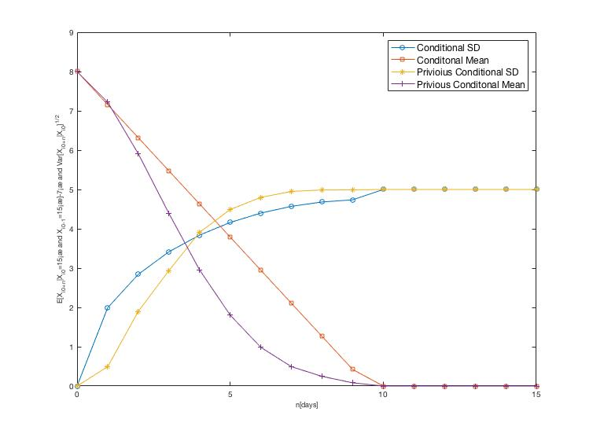
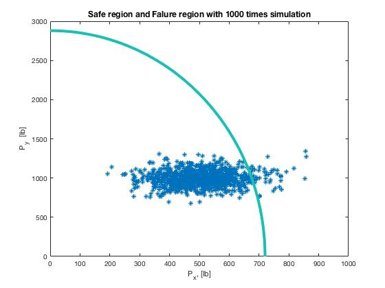

# RiskEngineering609  

## Introduction
* This reposotory is created for the graduate level course CIVE609 Risk Enginnering in McGill University.  
* Several simulations about the probability were conducted in MatLab.  
* The assignment can be found in the folder, and here I also show some examples in the following.  

### Assignment2

> The assignment2 can be viewed from the
https://github.com/ZhangHexiao/RiskEngineering609/blob/master/Assignment2PictureCode/Assignment%202.pdf

=========================================
### Assignment3

> The assignment3 can be viewed from the
https://github.com/ZhangHexiao/RiskEngineering609/blob/master/Assignment3PictureCode/Assignment%203.pdf

=========================================
